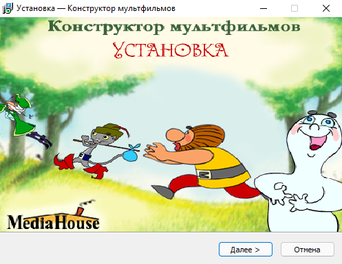

# Multi-Pulti Tools
Инструментарий для работы с ресурсами конструктора мультфильмов от издателя *MediaHouse*.

# Multi-Pulti

Детский конструктор мультфильмов из конца девяностых. Разработан **Basi**.


Известные релизы/редакции:

- Мульти-Пульти
- Новые Бременские
- Незнайка и все-все-все
- Мои любимые герои

## Ресурсы

Директория `BMP/`* включает в себя основные ресурсы движка.

- `anm.lib` - анимации, внутренний формат `AN`.

- `anm_s.lib` - предварительный просмотр анимаций при выборе в меню.

- `fon.lib` - фоновые изображения сцен.

- `fon_s.lib` - предварительный просмотр фоновых изображений при выборе в меню.

- `stat.lib` - статичные объекты (изображения), RGB(0,0,255) замещается прозрачным.

- `stat_s.lib` - предварительный просмотр статичных объектов (изображений).

- `wav_ef.lib` - эффекты.

- `wav_mus.lib` - музыка.

## Фейковые ресурсы

Для увеличения занимаемого места на диске разработчики (или издатель) добавляли ресурсы пустышки, которые не являются корректными библитеками, например, `WAV_NRT.LIB` или `WAV_TIR.LIB`.

## Форматы файлов

За исключением файлов анимаций, остальные форматы файлов (`BMP` и `WAV`) являются стандартными, но с модифицированным заголовком.

`libex` автоматически преобразовывает заголовок к стандартному при упаковке или извлечении файлов из архивов:

- **WAV**, PCM, 16bits
- **BMP**, 8-bit

# Утилиты

[Инструменты командной строки](utils) для упаковки/распаковки и преобразования ресурсов.

*Требования*

- Python > 3.8


# libex

Распаковщик\упаковщик игровых архивов (`.lib`)

- Распаковывает архивы всех типов: анимации, превью анимаций, фоны, превью фонов, музыку и звуки.
- Упаковывает ресурсы (`BMP`, `WAV`, `ANM`) в архивы.
- Поддерживает версии архивов: `0` и `1`.
- Автоматически конвертирует ресурсы типа `BMP` и `WAV` из внутреннего в стандартный формат.

## unpack

Распаковать библиотеку.

| Option        | Default | Description                                  |
| ------------- | ------- | -------------------------------------------- |
| `-h/--help`   |         | Список доступных команд                      |
| `-i/--input`  |         | Исходный lib файл                            |
| `-o/--output` |         | Выходной каталог для извлечения файлов       |
| `-r/--raw`    | `false` | Извлечение сырых данных (без преобразования) |

## pack

Собрать файлы в билиотеку.

| Option         | Default | Description                                                  |
| -------------- | ------- | ------------------------------------------------------------ |
| `-h/--help`    |         | Список доступных команд                                      |
| `-i/--input`   |         | Путь к каталогу для упаковки                                 |
| `-o/--output`  |         | Выходной lib файл                                            |
| `-t/--type`    |         | Тип выходной библиотеки: `bmp_v1`, `bmp_v2`, `anm_v1`, `anm_v2`, `anm_v3`, `wav_v1` or `wav_v2` |
| `-v/--version` | `1`     | Версия архива [`0`,`1`]                                      |
| `-r/--raw`     | `false` | Упаковка сырых данных (без преобразования)                   |
| `-s/--strict`  | `true`  | Автоматическое усечение имен файлов                          |

# anm2anm

Конвертер анимаций версии `1` в версию `2` для новых исполнительных файлов игры (движка).

| Option        | Default | Description                                 |
| ------------- | ------- | ------------------------------------------- |
| `-i/--input`  |         | Путь к каталогу или файлу анимации          |
| `-o/--output` |         | Путь к выходной каталогу или файлу анимации |

# Пример

```cmd
:: Распаковка
libex unpack -i fon_s.lib -o out_fon_s
Unpack lib: fon_s.lib
Type: bmp_v1
Version: 1
Files count: 4
Raw mode: False
Extracting...
1.bmp : ok
2.bmp : ok
3.bmp : ok
4.bmp : ok
Done

:: Упаковка
libex pack -i out_fon_s -o fon_s_copy.lib -t bmp_v1 -v 1
Processing...
1.bmp : ok
2.bmp : ok
3.bmp : ok
4.bmp : ok
Lib: fon_s_copy.lib
Type: bmp_v1
Version: 1
Total files: 4
Raw mode: False
Truncate filename: True
Done
```

# Тесты

[Тест корректности обработки](utils/tests/test.win.bat) с использованием заранее подготовленных файлов.

# Шаблоны

Шаблоны разбора библиотек для [010 Editor](https://www.sweetscape.com/010editor/) можно [взять тут](formats). 


# Патч совместимости

Небольшой патч, сделан на основе наиболее свежего исполнительного файла (выбран по размеру и дате сборки из доступных образов в сети).

- Исправляет проблему совместимости с Windows 8 - Windows 10 (на тех системах, где игра не запускалась).
- Исправляет проблему отрисовки с кривыми координатами при использовании высокого DPI в системе.
- Полноэкранный режим. Параметр `Fullscreen=1` в `Setup.ini`, автоматически изменяет разрешение дисплея до разрешения игры, после завершения процесса игры восстанавливает.
- Читает ресурсы из директории приложения, исправляет явление, когда возникала проблема "потери ресурсов" при запуске с ярлыка.


# Известные проблемы

- Падение приложения при соранении фильма:

	Скорее всего функция сохранения\загрузки фильмов некорректно читает или создает файл внутреннего формата, не ресерчилось.

# Сборка

## Пакетная обработка

[Набор сценариев](scripts)

`unpack_all.py` - распакуовывает все бибилиотеки с диска в указанную папку.

`combine_multi.py`- сбор файлов из `sources` в `target` директорию без дупбликатов.

## Инсталлер

[Шаблон установщика](build) на базе [InnoSetup](https://jrsoftware.org/isinfo.php) для собственнной сборки.




